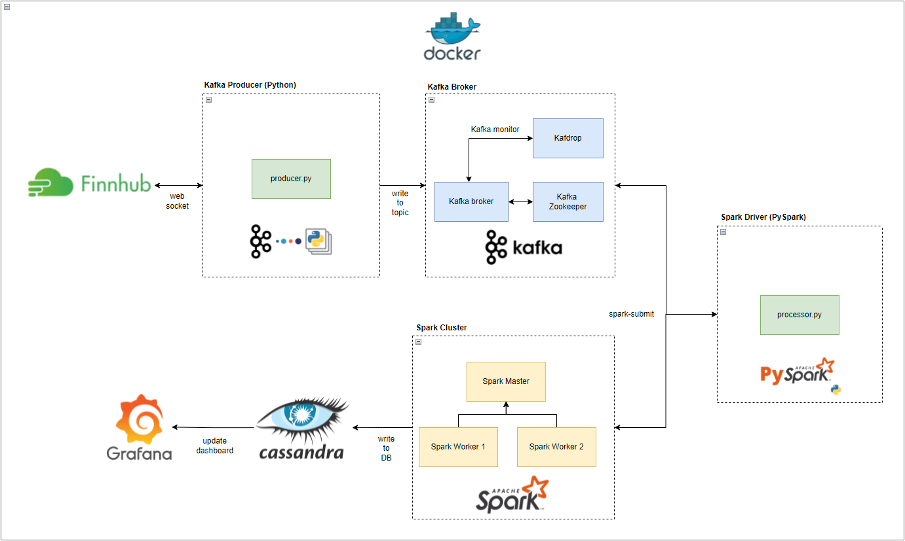
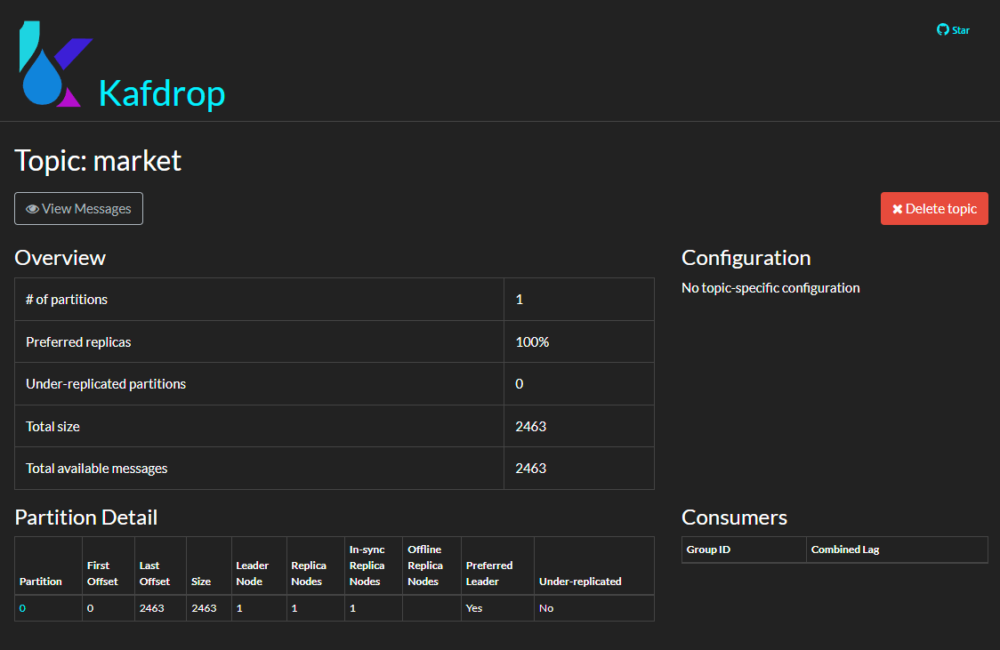
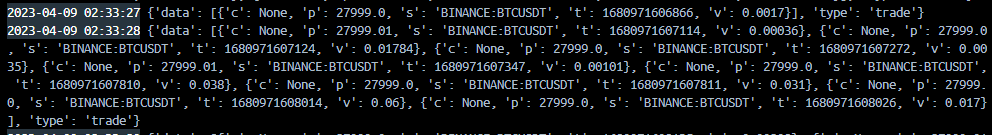
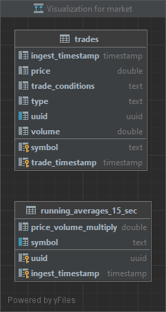
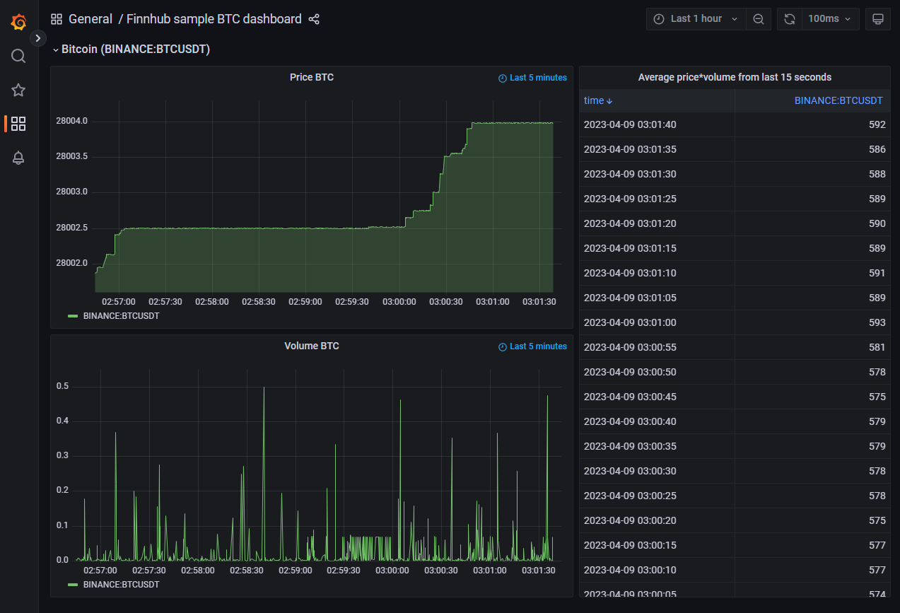

# Real Time Stock Tracker Pipeline
This project is a data streaming pipeline for Finnhub stock market ticker data using Kafka, Spark, Cassandra. This project is intended to showcase the setup of an end-to-end containerised data streaming pipeline that is highly scalable.

Thank you to GitHub user RSKriegs for the inspiration on the solution architecture and data source for this personal project. You can find their original implementation of this project here: [!https://github.com/RSKriegs/finnhub-streaming-data-pipeline].
I will delve into the rationale behind the technologies used, going through the high level workings of each framework used, as well as the containerization strategy.

# The stack
- Python 3.7
- Apache Kafka
- Apache Spark
- Cassandra DB
- Grafana

# Solution Architecture

# The Objective
The data source for this project is Finnhub, and we will be building a real-time dashboard to track Bitcoin:USD price & volume metrics. To ferry the data from the upstream source (Finnhub websocket) to the dashboard application we are building, we will need a robust pipeline in the middle to handle the I/O. This is where kafka will come into play as the message broker, and a standalone Spark cluster to provide the processing grunt to transform and write this data to the Cassandra DB. It is important to note that for the purpose of this demo project, each component will be dockerised and the entire stack can be ran locally using `docker compose up --build -d`. Proper CI/CD should be setup using kubernetes orchestration. With minor code refactoring, we can easily set this up to run remotely on EKS/ECS with higher redundancy.

# Initial setup

## Kafka Cluster
Kafka is a distributed messaging system that allows producers to write data to topics and consumers to read data from topics. Producers and consumers in Kafka are client applications that use the Kafka API to interact with the Kafka cluster. Overall, the Kafka producer and consumer APIs provide a powerful and flexible way to write and read data to and from Kafka topics. The producer and consumer APIs allow developers to build highly scalable and fault-tolerant applications that can process and analyze large volumes of data in real-time.

Our Kafka cluster will be run on docker, and the container configurations can be found in the `docker-compose.yaml` file in the root directory:
- zookeeper container:  A distributed coordination service that is used by Apache Kafka to manage and maintain the Kafka cluster. ZooKeeper helps Kafka in performing several important tasks, such as leader election, broker registration, and cluster membership management.
- broker container: A broker is a server that is responsible for managing a portion of the Kafka topic partitions. Brokers store the topic partitions, receive messages from producers, and deliver messages to consumers. Brokers also maintain metadata information about the topic partitions, such as the number of partitions, replication factor, and the location of partition replicas.
- Kafdrop container: An open-source web-based tool for monitoring Apache Kafka clusters. It provides a user-friendly web interface for visualizing the Kafka topics, partitions, messages, and consumer groups, and allows you to monitor the real-time activity of your Kafka cluster.

## Producer
We'll start off by writing a long-running python service that subscribes to the Binance Bitcoin trading topic on the Finnhub WS endpoint. This producer app uses `websocket` and `kafka-python` to read messages in near real time via the web socket and encodes each json response in avro binary format. Each message is sent to the Kafka broker we set up in the docker compose file above. Since we are using Kafka as a message bus only, we are mainly interested in sending these ticker data points to a single topic for the purpose of consuming them asynchronously in a separate spark processing cluster.

## Test Consumer
This is something I added for testing purposes to validate that the Kafka cluster was setup properly and the producer app was successfully pulling data from the web socket and submitting them to the kafka topic. This definitely helped debugging formatting issues with AVRO conversions prior to writing up the spark processor app.

Here is an example console output of the test consumer app that was reading from Kafka, AVRO decoding, and printing the payload to console:

## Cassandra DB
The data store of choice for this project is Cassandra DB. Cassandra is known to be quite resilient and scalable. Cassandra is optimized for time-series data, and if we can leverage time-based UUIDs properly we can greatly improve performance at scale. 

Our Cassandra instance has a single keyspace called `market`, within which are two tables which our Spark cluster writes to:
* Atomic fact table: `trades` - stores the individual ticker data points
* Aggregated view table: `running_averages_15_sec` - Running average of price x volume in rolling 15 second window.

## Spark Processor (Consumer)
We will be using a standalone Spark cluster (Docker) with one master node and two worker nodes to process the kafka messages and write our cleaned data to Cassandra. The `StreamProcessor` docker image is used to submit a `Pyspark` application to the Spark cluster via `spark-submit` command, and most impoortantly injects the `kafka` and `cassandra` connector dependencies to ensure the Spark cluster can connect the kafka broker as well as the cassandra DB we setup. It is important to ensure matching dependency versions based on Python and Spark versions used in the spark cluster and the driver otherwise you will run into obscure Spark errors. Note the dependency format `<groupId>`:`<artifactId>`:`<version>` in the `spark-submit` example below which is the final CMD ran for the `StreamProcessor` Docker image:  

`spark-submit --master spark://spark-master:7077 --packages org.apache.spark:spark-sql-kafka-0-10_2.12:3.2.1,org.apache.spark:spark-avro_2.12:3.2.1,com.datastax.spark:spark-cassandra-connector_2.12:3.2.0 src/main.py`

## Grafana Dashboard
Grafana is an open-source platform for data visualization and monitoring. It allows you to create dashboards that display real-time data from a variety of sources such as databases and APIs. With Grafana, we can visualize our stock market data in a variety of ways, including charts, graphs, and tables. This makes it a suitable low-code solution for us to visualise our price (line chart), volume (line chart) and price x volume graphs (tabular) data.

We run Grafana in a docker image which is configured to read from our Cassandra DB tables `trades` and `running_averages_15_sec`.

Grafana allows you to customize your visualizations with a variety of options, such as adding annotations, thresholds, and alerts. This makes it easy to monitor stock data for specific events, such as price changes or volume spikes.

## Improvements & Takeaways
* Log tracing with Spark clusters can be painful. It would be great to setup robust log monitoring by segmenting different log levels and using a third party monitoring tool to more easily access these logs and debug errors that may not be easily detected sifting through raw logs within each docker instance.
* Clean up CI/CD and use Kubernetes to orchestrate the docker containers.
* Integrate Grafana free tier monitoring for Kafka server & Kubernetes.
* Add multiple stock tickers and add more aggregated views such as hourly comparisons or anomaly detection.
